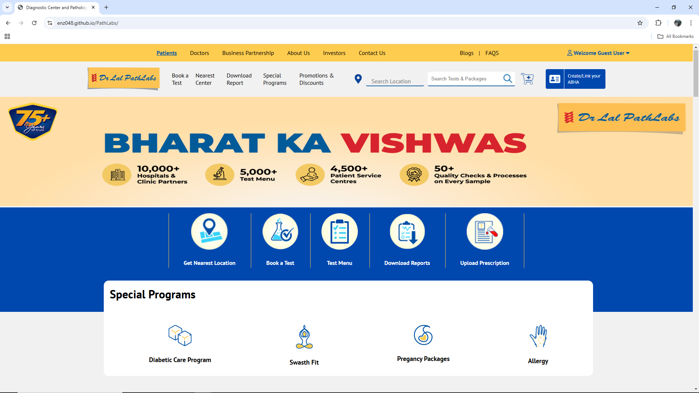
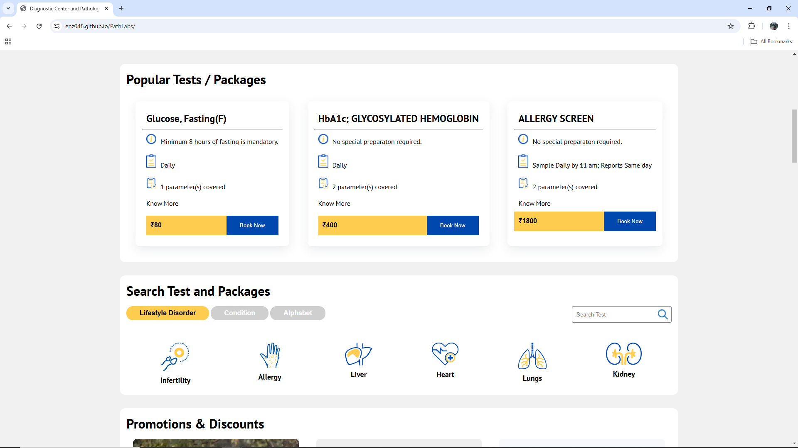
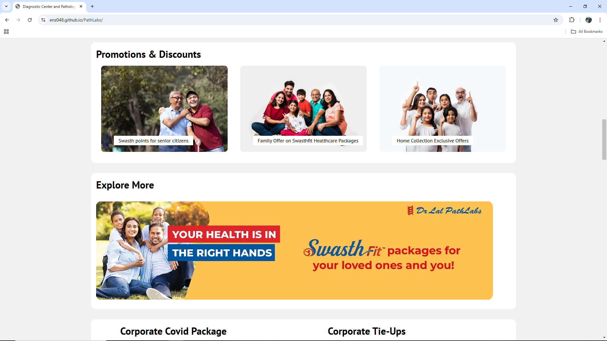
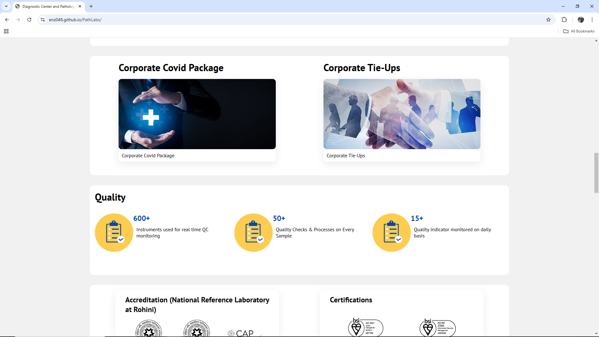
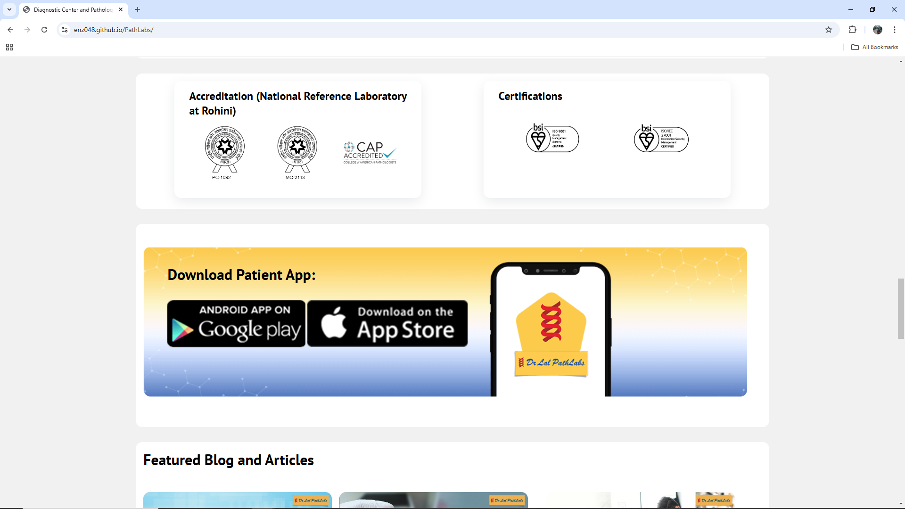
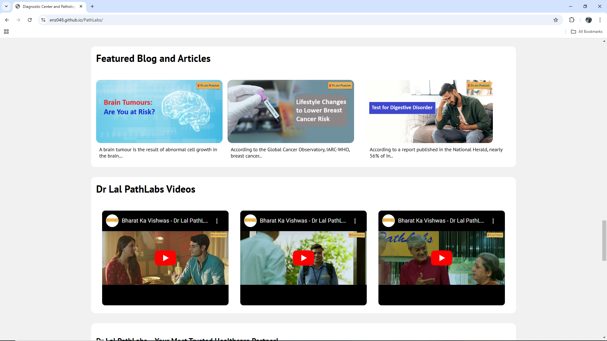
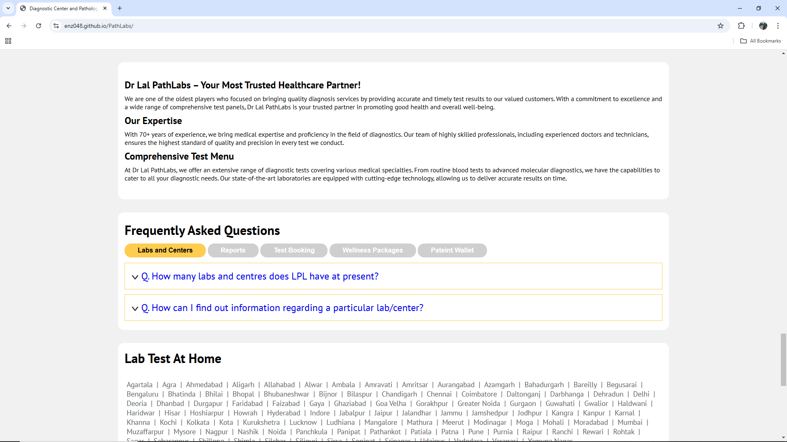
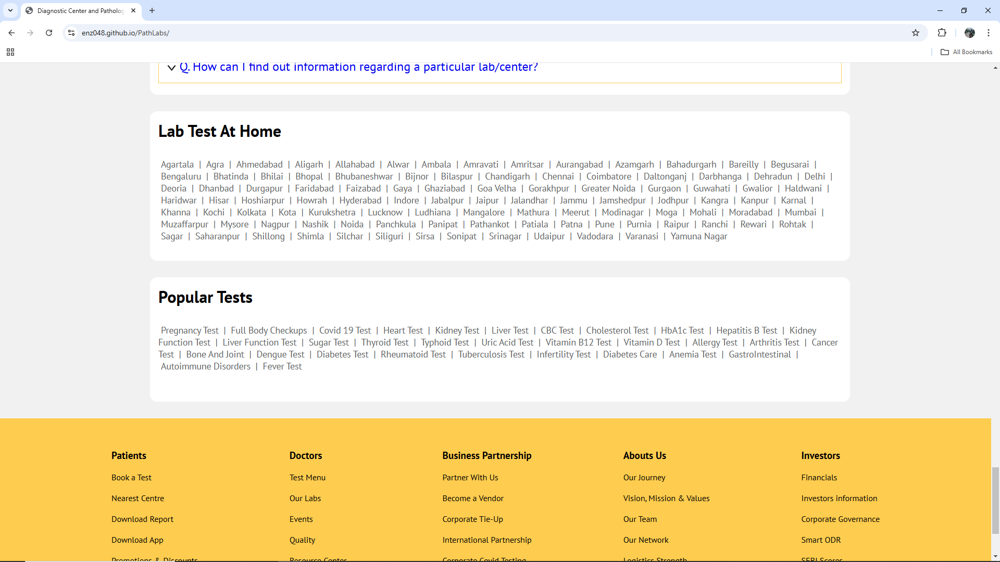
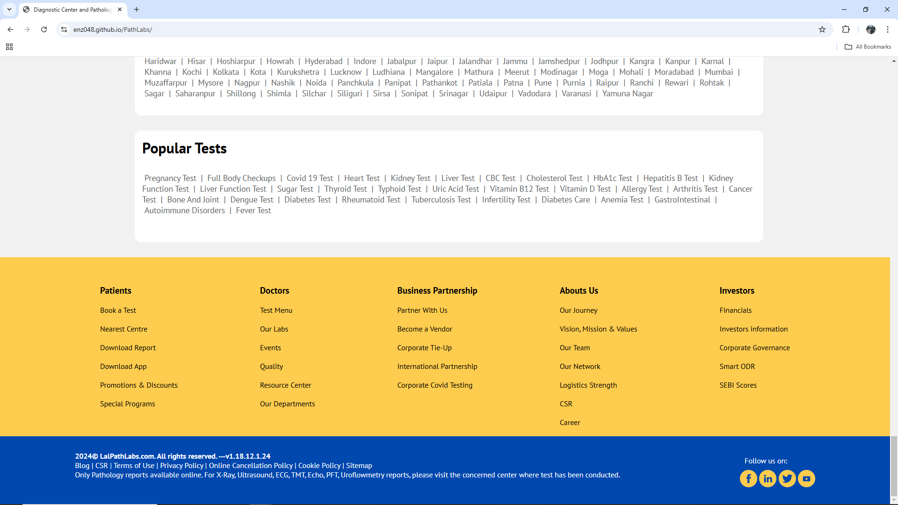

# 🌐 PathLabs Website 

## 📝 Overview  
This repository contains a clone of the homepage of Pathlabs, created using HTML and CSS. The project aims to replicate the look and feel of the original Pathlabs homepage for educational and practice purposes.

## 📂 Technologies Used  
- **HTML5**  
- **CSS3**  
- **Responsive Design**  

---

## 📜 Features  
- 🌟 **Fully Responsive Design** for various devices.  
- 🌟 **Clean UI: Accurate replication of the original design with attention to detail.  
- 🌟 **HTML and CSS: Built purely using HTML and CSS, showcasing front-end development skills..  

---

## 🌐 Main Repository  
[Path Labs - GitHub Repository](https://github.com/ENZ048/PathLabs)  

---

## 📸 Screenshots  
- **Landing Page**
  
  
  
  
  
  
  
  
  
  
---

## 📞 Contact  

### 👩‍💼 Pratik Yesare**  
- 🌐 [GitHub Profile](https://github.com/ENZ048)
- 🔗 [LinkedIn](https://www.linkedin.com/in/pratik-yesare/)

## Future Improvements 🚀
- Add JavaScript for interactivity.
- Optimize for better performance and loading speed.
- Enhance responsiveness for smaller screen sizes.
